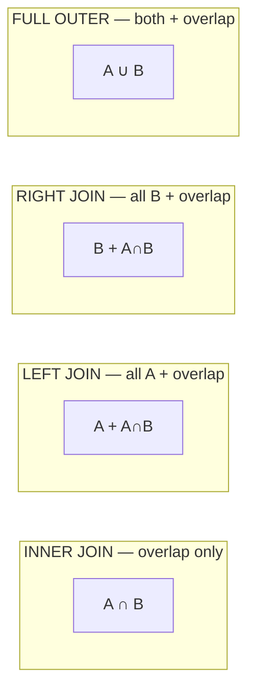

# SQL — Complete Revision Notes (Basic to Advanced)

> Friendly, structured notes covering everything from `SELECT` to window functions and CTEs. Read top-to-bottom once, then re-read the **Quick Q&A** at the end before your interview.

---

# Chapter 1: What is SQL?

**SQL** = **Structured Query Language**. It's the language you use to talk to a database.

- Pronounced "sequel" or "S-Q-L" — either is fine
- Created in the 1970s at IBM
- Standard for **relational databases**: MySQL, PostgreSQL, SQLite, Oracle, MS SQL Server
- **Declarative** language — you say *what* you want, not *how* to get it

**What's a database?** A structured collection of tables. Each table has rows (records) and columns (fields), like a spreadsheet.

Example: an `employees` table
| id | name | department | salary |
|---|---|---|---|
| 1 | Ronit | AI | 50000 |
| 2 | Priya | Data | 60000 |
| 3 | Amit | AI | 55000 |

---

# Chapter 2: Basic SQL Commands (the 4 categories)

SQL commands are grouped into 4 categories:

| Category | What | Examples |
|---|---|---|
| **DDL** (Data Definition) | Define/modify table structure | `CREATE`, `ALTER`, `DROP`, `TRUNCATE` |
| **DML** (Data Manipulation) | Modify the data itself | `INSERT`, `UPDATE`, `DELETE` |
| **DQL** (Data Query) | Read data | `SELECT` |
| **DCL** (Data Control) | Permissions | `GRANT`, `REVOKE` |
| **TCL** (Transaction Control) | Transactions | `COMMIT`, `ROLLBACK`, `SAVEPOINT` |

**For interviews:** DDL/DML/DQL are the big three. Know them.

---

# Chapter 3: Creating, Modifying, Dropping Tables (DDL)

### Create a table

```sql
CREATE TABLE employees (
    id INT PRIMARY KEY,
    name VARCHAR(50) NOT NULL,
    department VARCHAR(30),
    salary DECIMAL(10, 2),
    hire_date DATE,
    is_active BOOLEAN DEFAULT TRUE
);
```

**Common data types:**
- `INT`, `BIGINT` — whole numbers
- `DECIMAL(p, s)` or `NUMERIC` — exact decimals (precision, scale)
- `FLOAT`, `DOUBLE` — approximate decimals
- `VARCHAR(n)` — variable-length string up to n characters
- `CHAR(n)` — fixed-length string
- `TEXT` — long string
- `DATE`, `DATETIME`, `TIMESTAMP` — dates and times
- `BOOLEAN` — true/false

**Constraints (rules on columns):**
- `PRIMARY KEY` — unique identifier, can't be NULL
- `NOT NULL` — must have a value
- `UNIQUE` — no duplicates allowed
- `DEFAULT value` — default if not provided
- `CHECK (condition)` — value must satisfy the condition
- `FOREIGN KEY` — references another table's primary key

### Modify a table

```sql
-- Add a column
ALTER TABLE employees ADD COLUMN email VARCHAR(100);

-- Drop a column
ALTER TABLE employees DROP COLUMN email;

-- Rename a column
ALTER TABLE employees RENAME COLUMN name TO full_name;

-- Change data type
ALTER TABLE employees ALTER COLUMN salary TYPE DECIMAL(12, 2);
```

### Delete a table

```sql
DROP TABLE employees;          -- removes table and ALL its data
TRUNCATE TABLE employees;      -- removes all rows but keeps the table
```

**`DROP` vs `TRUNCATE` vs `DELETE`** (classic interview question):
- `DROP` — removes the whole table (structure + data)
- `TRUNCATE` — removes all rows, keeps the table; can't be rolled back; fast
- `DELETE` — removes specific rows (can use WHERE); can be rolled back; slow

---

# Chapter 4: Inserting, Updating, Deleting Data (DML)

### INSERT — add new rows

```sql
-- Single row
INSERT INTO employees (id, name, department, salary)
VALUES (1, 'Ronit', 'AI', 50000);

-- Multiple rows
INSERT INTO employees (id, name, department, salary)
VALUES 
    (2, 'Priya', 'Data', 60000),
    (3, 'Amit', 'AI', 55000),
    (4, 'Neha', 'HR', 45000);

-- From another table
INSERT INTO archived_employees SELECT * FROM employees WHERE is_active = FALSE;
```

### UPDATE — modify existing rows

```sql
-- Update one column
UPDATE employees 
SET salary = 65000 
WHERE id = 2;

-- Update multiple columns
UPDATE employees 
SET salary = salary * 1.1, department = 'ML'
WHERE department = 'AI';
```

⚠️ **Always use WHERE in UPDATE!** Without it, you update every row in the table.

### DELETE — remove rows

```sql
DELETE FROM employees WHERE id = 4;
DELETE FROM employees WHERE department = 'HR';

-- Delete all rows (but keep table)
DELETE FROM employees;
```

⚠️ Same warning — always use WHERE unless you really mean to delete everything.

---

# Chapter 5: SELECT — the heart of SQL

### Basic SELECT

```sql
-- Select all columns, all rows
SELECT * FROM employees;

-- Select specific columns
SELECT name, salary FROM employees;

-- Alias columns
SELECT name AS employee_name, salary AS monthly_pay FROM employees;
```

### WHERE — filter rows

```sql
SELECT * FROM employees WHERE salary > 50000;
SELECT * FROM employees WHERE department = 'AI';
SELECT * FROM employees WHERE name LIKE 'R%';   -- starts with R
```

### Comparison operators
```
=     equal to
<>    not equal (also !=)
>     greater than
<     less than
>=    greater than or equal
<=    less than or equal
```

### Logical operators
```sql
WHERE salary > 50000 AND department = 'AI'
WHERE salary > 80000 OR department = 'HR'
WHERE NOT department = 'HR'
```

### Special operators

```sql
-- BETWEEN (inclusive range)
WHERE salary BETWEEN 40000 AND 60000

-- IN (matches any value in a list)
WHERE department IN ('AI', 'Data', 'ML')

-- NOT IN
WHERE department NOT IN ('HR')

-- LIKE (pattern matching)
WHERE name LIKE 'R%'         -- starts with R
WHERE name LIKE '%a'         -- ends with a
WHERE name LIKE '%on%'       -- contains "on"
WHERE name LIKE '_onit'      -- _ = exactly one character

-- IS NULL / IS NOT NULL (always use this, never = NULL)
WHERE email IS NULL
WHERE email IS NOT NULL
```

### ORDER BY — sort the results

```sql
SELECT * FROM employees ORDER BY salary;            -- ascending (default)
SELECT * FROM employees ORDER BY salary DESC;       -- descending
SELECT * FROM employees ORDER BY department, salary DESC;  -- multi-column
```

### LIMIT and OFFSET — pagination

```sql
SELECT * FROM employees LIMIT 5;              -- top 5 rows
SELECT * FROM employees LIMIT 5 OFFSET 10;    -- skip 10, then take 5
```

### DISTINCT — remove duplicates

```sql
SELECT DISTINCT department FROM employees;
-- Returns: AI, Data, HR (no duplicates)
```

---

# Chapter 6: Aggregate Functions (summarizing data)

Aggregate functions take many rows and return one value.

```sql
SELECT COUNT(*) FROM employees;              -- total rows
SELECT COUNT(email) FROM employees;          -- non-NULL emails count
SELECT COUNT(DISTINCT department) FROM employees;   -- unique departments

SELECT SUM(salary) FROM employees;           -- total salary
SELECT AVG(salary) FROM employees;           -- average salary
SELECT MIN(salary) FROM employees;           -- lowest salary
SELECT MAX(salary) FROM employees;           -- highest salary
```

**Common aggregates:**
| Function | What it does |
|---|---|
| `COUNT(*)` | Count of all rows |
| `COUNT(col)` | Count of non-NULL values in `col` |
| `SUM(col)` | Sum of values |
| `AVG(col)` | Average |
| `MIN(col)` | Smallest value |
| `MAX(col)` | Largest value |

---

# Chapter 7: GROUP BY — aggregations by category

When you want totals/averages **per group**, use GROUP BY.

```sql
-- Average salary per department
SELECT department, AVG(salary) AS avg_salary
FROM employees
GROUP BY department;
```

Result:
| department | avg_salary |
|---|---|
| AI | 52500 |
| Data | 60000 |
| HR | 45000 |

**Rule:** Every column in SELECT that's NOT in an aggregate function MUST be in GROUP BY.

```sql
-- Count and average per department
SELECT department, COUNT(*) AS headcount, AVG(salary) AS avg_salary
FROM employees
GROUP BY department;

-- Multiple GROUP BY columns
SELECT department, is_active, COUNT(*)
FROM employees
GROUP BY department, is_active;
```

### HAVING — filter groups (like WHERE for groups)

```sql
-- Only departments with more than 2 employees
SELECT department, COUNT(*) AS headcount
FROM employees
GROUP BY department
HAVING COUNT(*) > 2;
```

**WHERE vs HAVING** (very common interview question):
- `WHERE` filters **rows BEFORE grouping**
- `HAVING` filters **groups AFTER grouping**

```sql
SELECT department, AVG(salary) AS avg_sal
FROM employees
WHERE is_active = TRUE              -- filter rows before grouping
GROUP BY department
HAVING AVG(salary) > 50000;          -- filter groups after grouping
```

---

# Chapter 8: JOINs — combining tables

JOINs are how you merge data from multiple tables. Probably the **#1 interview topic**.

### Sample tables

`employees`
| id | name | dept_id |
|---|---|---|
| 1 | Ronit | 10 |
| 2 | Priya | 20 |
| 3 | Amit | 10 |
| 4 | Neha | NULL |

`departments`
| dept_id | dept_name |
|---|---|
| 10 | AI |
| 20 | Data |
| 30 | HR |

### INNER JOIN — only matching rows

```sql
SELECT e.name, d.dept_name
FROM employees e
INNER JOIN departments d ON e.dept_id = d.dept_id;
```
Result: Ronit-AI, Priya-Data, Amit-AI (Neha excluded because dept_id is NULL; HR excluded because no employee)

### LEFT JOIN — all from left + matching from right

```sql
SELECT e.name, d.dept_name
FROM employees e
LEFT JOIN departments d ON e.dept_id = d.dept_id;
```
Result: Ronit-AI, Priya-Data, Amit-AI, Neha-NULL (all employees, even Neha)

### RIGHT JOIN — all from right + matching from left

```sql
SELECT e.name, d.dept_name
FROM employees e
RIGHT JOIN departments d ON e.dept_id = d.dept_id;
```
Result: Ronit-AI, Priya-Data, Amit-AI, NULL-HR (all departments, even HR with no employees)

### FULL OUTER JOIN — everything from both sides

```sql
SELECT e.name, d.dept_name
FROM employees e
FULL OUTER JOIN departments d ON e.dept_id = d.dept_id;
```
Result: all 4 employees + HR (everything from both)

### CROSS JOIN — every combination (Cartesian product)

```sql
SELECT e.name, d.dept_name
FROM employees CROSS JOIN departments;
```
Result: 4 employees × 3 departments = 12 rows. Rarely useful — be careful.

### SELF JOIN — join a table with itself

When a table refers to itself. Example: an employee has a manager who is also in the employees table.

```sql
-- Each employee with their manager's name
SELECT e.name AS employee, m.name AS manager
FROM employees e
LEFT JOIN employees m ON e.manager_id = m.id;
```

### Visual JOIN summary



### Joining 3+ tables

```sql
SELECT e.name, d.dept_name, p.project_name
FROM employees e
INNER JOIN departments d ON e.dept_id = d.dept_id
INNER JOIN projects p ON e.project_id = p.id;
```

Just chain the JOINs. The result keeps building.

---

# Chapter 9: Subqueries

A subquery is a query inside another query.

### Subquery in WHERE

```sql
-- Employees earning more than the average
SELECT name, salary
FROM employees
WHERE salary > (SELECT AVG(salary) FROM employees);
```

### Subquery with IN

```sql
-- Employees in departments where avg salary > 50000
SELECT name FROM employees 
WHERE dept_id IN (
    SELECT dept_id FROM employees 
    GROUP BY dept_id 
    HAVING AVG(salary) > 50000
);
```

### Subquery in SELECT (scalar subquery)

```sql
SELECT name, salary, 
       (SELECT AVG(salary) FROM employees) AS company_avg
FROM employees;
```

### Subquery in FROM (derived table)

```sql
SELECT dept_id, max_sal
FROM (
    SELECT dept_id, MAX(salary) AS max_sal
    FROM employees
    GROUP BY dept_id
) AS dept_max
WHERE max_sal > 50000;
```

### Correlated subquery
A subquery that references the outer query.

```sql
-- Employees whose salary is above their department's average
SELECT e.name, e.salary
FROM employees e
WHERE e.salary > (
    SELECT AVG(salary) FROM employees 
    WHERE dept_id = e.dept_id     -- references outer 'e'
);
```

Correlated subqueries run **once per outer row** (slower). Often you can rewrite them as JOINs or window functions for better performance.

---

# Chapter 10: CTEs (Common Table Expressions) — `WITH` clause

A CTE is a **temporary named result set** you can use within a single query. Think of it as a "named subquery" that makes your SQL readable.

### Basic CTE

```sql
WITH high_earners AS (
    SELECT name, salary, dept_id
    FROM employees
    WHERE salary > 60000
)
SELECT * FROM high_earners ORDER BY salary DESC;
```

### Multiple CTEs

```sql
WITH 
dept_avg AS (
    SELECT dept_id, AVG(salary) AS avg_sal 
    FROM employees GROUP BY dept_id
),
top_dept AS (
    SELECT dept_id FROM dept_avg WHERE avg_sal > 55000
)
SELECT e.name, e.salary, d.dept_name
FROM employees e
JOIN top_dept t ON e.dept_id = t.dept_id
JOIN departments d ON e.dept_id = d.dept_id;
```

### Why use CTEs?

1. **Readability** — break complex queries into named steps
2. **Reusability** — reference the same result multiple times in one query
3. **Maintainability** — easier to debug than deeply nested subqueries

### Recursive CTE (advanced — for hierarchies)

For data with parent-child relationships (org charts, file systems, family trees).

```sql
-- Find all employees reporting to manager_id = 1 (direct + indirect)
WITH RECURSIVE org_tree AS (
    -- Anchor: starting point
    SELECT id, name, manager_id, 1 AS level
    FROM employees
    WHERE manager_id = 1
    
    UNION ALL
    
    -- Recursive part: keep finding subordinates
    SELECT e.id, e.name, e.manager_id, ot.level + 1
    FROM employees e
    INNER JOIN org_tree ot ON e.manager_id = ot.id
)
SELECT * FROM org_tree;
```

**For interview:** *"A CTE is a temporary named query block defined with `WITH`. It makes complex queries readable by breaking them into named steps. Recursive CTEs handle hierarchical data."*

---

# Chapter 11: Window Functions (THE INTERVIEW FAVORITE)

Window functions are like aggregations, but **they don't collapse rows** — they keep every row and add a computed value.

**Regular GROUP BY:**
```sql
SELECT dept_id, AVG(salary) FROM employees GROUP BY dept_id;
-- Returns 3 rows (one per dept) — original rows are lost
```

**Window function:**
```sql
SELECT name, salary, dept_id,
       AVG(salary) OVER (PARTITION BY dept_id) AS dept_avg
FROM employees;
-- Returns ALL rows + adds dept_avg column to each
```

### The OVER clause

`OVER (...)` is what makes a function a window function.

```sql
function() OVER (
    PARTITION BY column1     -- like GROUP BY but doesn't collapse
    ORDER BY column2         -- order within each partition
    ROWS BETWEEN ...         -- frame: which rows to include
)
```

### Common Window Functions

#### 1. Ranking functions

```sql
-- ROW_NUMBER — gives each row a unique number (1, 2, 3, ...)
SELECT name, salary,
       ROW_NUMBER() OVER (ORDER BY salary DESC) AS row_num
FROM employees;

-- RANK — same rank for ties, leaves gaps (1, 2, 2, 4)
SELECT name, salary,
       RANK() OVER (ORDER BY salary DESC) AS rank
FROM employees;

-- DENSE_RANK — same rank for ties, no gaps (1, 2, 2, 3)
SELECT name, salary,
       DENSE_RANK() OVER (ORDER BY salary DESC) AS dense_rank
FROM employees;
```

**ROW_NUMBER vs RANK vs DENSE_RANK** (common interview question):

If three people have salaries: 90k, 80k, 80k, 70k

| Function | Result |
|---|---|
| ROW_NUMBER | 1, 2, 3, 4 |
| RANK | 1, 2, 2, 4 (gap) |
| DENSE_RANK | 1, 2, 2, 3 (no gap) |

#### 2. NTILE — divide into buckets

```sql
-- Split into 4 salary quartiles
SELECT name, salary,
       NTILE(4) OVER (ORDER BY salary DESC) AS quartile
FROM employees;
```

#### 3. Aggregate window functions

```sql
-- Each employee's salary + their department's total/average
SELECT name, dept_id, salary,
       SUM(salary) OVER (PARTITION BY dept_id) AS dept_total,
       AVG(salary) OVER (PARTITION BY dept_id) AS dept_avg,
       COUNT(*) OVER (PARTITION BY dept_id) AS dept_headcount,
       MAX(salary) OVER (PARTITION BY dept_id) AS dept_max
FROM employees;
```

#### 4. LAG and LEAD — peek at previous/next row

```sql
-- Compare each employee's salary to the previous row (by hire_date)
SELECT name, hire_date, salary,
       LAG(salary, 1) OVER (ORDER BY hire_date) AS prev_salary,
       LEAD(salary, 1) OVER (ORDER BY hire_date) AS next_salary,
       salary - LAG(salary, 1) OVER (ORDER BY hire_date) AS diff_from_prev
FROM employees;
```

- `LAG(col, n)` — value from `n` rows before (default 1)
- `LEAD(col, n)` — value from `n` rows after

Useful for: time-series analysis, comparing rows, calculating differences.

#### 5. FIRST_VALUE and LAST_VALUE

```sql
-- Each row gets the highest salary in its department
SELECT name, dept_id, salary,
       FIRST_VALUE(salary) OVER (PARTITION BY dept_id ORDER BY salary DESC) AS top_salary_in_dept
FROM employees;
```

#### 6. Running totals and moving averages

```sql
-- Running total of salary by hire date
SELECT name, hire_date, salary,
       SUM(salary) OVER (ORDER BY hire_date) AS running_total
FROM employees;

-- 3-row moving average
SELECT name, hire_date, salary,
       AVG(salary) OVER (
           ORDER BY hire_date 
           ROWS BETWEEN 1 PRECEDING AND 1 FOLLOWING
       ) AS moving_avg
FROM employees;
```

### Window frame specification

```sql
ROWS BETWEEN UNBOUNDED PRECEDING AND CURRENT ROW   -- from start to current
ROWS BETWEEN 2 PRECEDING AND CURRENT ROW           -- last 3 rows
ROWS BETWEEN CURRENT ROW AND 2 FOLLOWING           -- next 3 rows
ROWS BETWEEN UNBOUNDED PRECEDING AND UNBOUNDED FOLLOWING  -- all rows
```

### Common interview problem: Top N per group

**Question:** Find the top 2 highest-paid employees in each department.

```sql
WITH ranked AS (
    SELECT name, dept_id, salary,
           ROW_NUMBER() OVER (PARTITION BY dept_id ORDER BY salary DESC) AS rn
    FROM employees
)
SELECT * FROM ranked WHERE rn <= 2;
```

This pattern (CTE + ROW_NUMBER + filter) solves a TON of interview problems.

---

# Chapter 12: Set Operations

Combine results from two queries.

### UNION — combine, remove duplicates

```sql
SELECT name FROM employees
UNION
SELECT name FROM customers;
```

### UNION ALL — combine, keep duplicates (faster)

```sql
SELECT name FROM employees
UNION ALL
SELECT name FROM customers;
```

### INTERSECT — only rows in BOTH

```sql
SELECT name FROM employees
INTERSECT
SELECT name FROM customers;
```

### EXCEPT (or MINUS in Oracle) — rows in first, not in second

```sql
SELECT name FROM employees
EXCEPT
SELECT name FROM customers;
```

**Rules for set operations:**
- Both queries must have the same number of columns
- Columns must be the same (or compatible) types

---

# Chapter 13: String Functions

```sql
-- Length
LENGTH('Ronit')          -- 5

-- Case
UPPER('hello')           -- 'HELLO'
LOWER('HELLO')           -- 'hello'

-- Trimming
TRIM('  hello  ')        -- 'hello'
LTRIM('  hello')         -- 'hello'
RTRIM('hello  ')         -- 'hello'

-- Concatenation
CONCAT('Hello', ' ', 'World')    -- 'Hello World'
'Hello' || ' ' || 'World'         -- same (Postgres syntax)

-- Substring
SUBSTRING('Hello World' FROM 1 FOR 5)   -- 'Hello'
SUBSTR('Hello World', 7, 5)              -- 'World' (MySQL)

-- Replace
REPLACE('Hello World', 'World', 'SQL')   -- 'Hello SQL'

-- Position
POSITION('World' IN 'Hello World')       -- 7

-- LIKE / pattern matching (already covered)
WHERE name LIKE '%on%'
```

---

# Chapter 14: Date Functions

```sql
-- Current
SELECT CURRENT_DATE;          -- today's date
SELECT CURRENT_TIMESTAMP;     -- today's date + time
SELECT NOW();                 -- same

-- Extract parts
EXTRACT(YEAR FROM hire_date)
EXTRACT(MONTH FROM hire_date)
EXTRACT(DAY FROM hire_date)

-- Difference
DATEDIFF('2025-12-31', '2025-01-01')   -- 364 (MySQL)
AGE(hire_date)                          -- Postgres
CURRENT_DATE - hire_date                -- days difference (Postgres)

-- Add/subtract intervals (Postgres)
hire_date + INTERVAL '1 year'
hire_date + INTERVAL '7 days'

-- Format
TO_CHAR(hire_date, 'YYYY-MM-DD')    -- Postgres
DATE_FORMAT(hire_date, '%Y-%m-%d')   -- MySQL
```

---

# Chapter 15: CASE Statement (SQL's if-else)

```sql
SELECT name, salary,
    CASE 
        WHEN salary < 30000 THEN 'Junior'
        WHEN salary < 60000 THEN 'Mid'
        ELSE 'Senior'
    END AS level
FROM employees;
```

CASE also works in WHERE, GROUP BY, ORDER BY:

```sql
-- Count by level
SELECT 
    CASE 
        WHEN salary < 30000 THEN 'Junior'
        WHEN salary < 60000 THEN 'Mid'
        ELSE 'Senior'
    END AS level,
    COUNT(*)
FROM employees
GROUP BY level;
```

---

# Chapter 16: Indexes (performance basics)

An index is a data structure (usually B-tree) that speeds up SELECTs but slows down INSERTs/UPDATEs/DELETEs.

```sql
-- Create an index
CREATE INDEX idx_employees_dept ON employees(dept_id);

-- Drop
DROP INDEX idx_employees_dept;

-- Unique index
CREATE UNIQUE INDEX idx_email ON employees(email);

-- Composite (multi-column) index
CREATE INDEX idx_dept_salary ON employees(dept_id, salary);
```

**When to index:**
- Columns in WHERE clauses frequently
- Columns in JOIN conditions
- Columns in ORDER BY

**When NOT to index:**
- Very small tables
- Columns that change frequently (each update has to update the index too)
- Columns with few unique values (e.g., boolean — wastes space)

---

# Chapter 17: Transactions (ACID)

A transaction is a group of SQL statements that succeed or fail together.

```sql
BEGIN;                          -- start transaction (or START TRANSACTION)

UPDATE accounts SET balance = balance - 100 WHERE id = 1;
UPDATE accounts SET balance = balance + 100 WHERE id = 2;

COMMIT;                         -- save all changes
-- OR
ROLLBACK;                       -- undo all changes if something went wrong
```

### ACID properties (very common interview question)

- **A**tomicity — all-or-nothing. Either every statement succeeds or none do.
- **C**onsistency — database moves from one valid state to another.
- **I**solation — concurrent transactions don't see each other's intermediate states.
- **D**urability — once committed, changes persist even if power goes out.

### SAVEPOINT — partial rollback

```sql
BEGIN;
UPDATE employees SET salary = 70000 WHERE id = 1;
SAVEPOINT before_risky;
UPDATE employees SET salary = 999999 WHERE id = 2;   -- oops
ROLLBACK TO before_risky;       -- undo the last update, keep the first
COMMIT;
```

---

# Chapter 18: Normalization (database design)

Normalization = organizing data to reduce redundancy. Don't memorize the rules, just understand the idea.

- **1NF (First Normal Form)**: every cell has a single value (no lists, no nested data)
- **2NF**: 1NF + every non-key column depends on the **whole** primary key
- **3NF**: 2NF + no non-key column depends on another non-key column

**Why?** Avoid duplicating data → avoid update anomalies → save space.

**Denormalization** = sometimes you intentionally duplicate data for faster reads (common in data warehouses).

---

# Chapter 19: Performance Tips

1. **Use indexes** on columns you filter by
2. **`SELECT *` is bad** — only select the columns you need
3. **`LIKE '%abc'`** can't use indexes (leading wildcard). `LIKE 'abc%'` can.
4. **Avoid `OR` when possible** — sometimes `UNION` is faster
5. **Prefer JOINs over correlated subqueries** for performance
6. **Use EXPLAIN** to see the query plan: `EXPLAIN SELECT * FROM employees WHERE ...;`
7. **Filter early** — apply WHERE before JOINs when possible
8. **Don't COUNT(*) huge tables** — use approximate counts or maintain a counter
9. **Use LIMIT** when you only need top N rows
10. **Batch large INSERTs** instead of one row at a time

---

# Chapter 20: NULL handling (the trickster)

`NULL` means "unknown / missing." It behaves strangely.

```sql
NULL = NULL              -- NULL (not TRUE!)
NULL = 1                 -- NULL
NULL + 1                 -- NULL
WHERE col = NULL         -- never returns anything!
WHERE col IS NULL        -- correct way
WHERE col IS NOT NULL    -- check non-NULL
```

**Useful functions:**
```sql
-- COALESCE — return first non-NULL value
COALESCE(email, phone, 'no_contact')

-- NULLIF — return NULL if two values match
NULLIF(salary, 0)        -- treats 0 as NULL

-- IFNULL (MySQL) / ISNULL (SQL Server) / NVL (Oracle)
IFNULL(email, 'unknown')
```

**Aggregates ignore NULL:**
- `COUNT(col)` doesn't count NULLs
- `AVG(col)`, `SUM(col)` ignore NULLs
- `COUNT(*)` counts all rows (including those with NULLs)

---

# Chapter 21: Interview-Favorite Query Patterns

### Pattern 1: Second-highest value

```sql
-- Top 2 distinct salaries
SELECT DISTINCT salary FROM employees ORDER BY salary DESC LIMIT 1 OFFSET 1;

-- Using window function
WITH ranked AS (
    SELECT salary, DENSE_RANK() OVER (ORDER BY salary DESC) AS rk
    FROM employees
)
SELECT salary FROM ranked WHERE rk = 2;
```

### Pattern 2: Find duplicates

```sql
SELECT email, COUNT(*)
FROM employees
GROUP BY email
HAVING COUNT(*) > 1;
```

### Pattern 3: Delete duplicates (keep one)

```sql
DELETE FROM employees
WHERE id NOT IN (
    SELECT MIN(id) FROM employees GROUP BY email
);
```

### Pattern 4: Employees earning more than their manager

```sql
SELECT e.name
FROM employees e
JOIN employees m ON e.manager_id = m.id
WHERE e.salary > m.salary;
```

### Pattern 5: Top N per group (already shown)

```sql
WITH ranked AS (
    SELECT name, dept_id, salary,
           ROW_NUMBER() OVER (PARTITION BY dept_id ORDER BY salary DESC) AS rn
    FROM employees
)
SELECT * FROM ranked WHERE rn <= 3;
```

### Pattern 6: Running total

```sql
SELECT date, sales,
       SUM(sales) OVER (ORDER BY date) AS running_total
FROM daily_sales;
```

### Pattern 7: Difference from previous row

```sql
SELECT date, sales,
       sales - LAG(sales, 1) OVER (ORDER BY date) AS daily_change
FROM daily_sales;
```

### Pattern 8: Pivot (rows to columns)

```sql
-- Sales per month → one row per year, columns for each month
SELECT year,
       SUM(CASE WHEN month = 1 THEN sales END) AS jan,
       SUM(CASE WHEN month = 2 THEN sales END) AS feb,
       SUM(CASE WHEN month = 3 THEN sales END) AS mar
FROM monthly_sales
GROUP BY year;
```

---

# Chapter 22: Order of SQL Execution (CRITICAL for interviews)

The **written order** of a SQL query is NOT the same as the **execution order**.

**Written order:**
```
SELECT ... FROM ... JOIN ... WHERE ... GROUP BY ... HAVING ... ORDER BY ... LIMIT ...
```

**Execution order:**
```
1. FROM            (and JOINs) — gather the tables
2. WHERE           — filter rows
3. GROUP BY        — group them
4. HAVING          — filter the groups
5. SELECT          — pick columns / apply functions
6. DISTINCT        — remove duplicates
7. ORDER BY        — sort
8. LIMIT / OFFSET  — take top N
```

**Why this matters:**
- You can't reference a SELECT alias in WHERE (because WHERE runs before SELECT)
- You CAN reference a SELECT alias in ORDER BY (because it runs after)
- HAVING runs after GROUP BY, so it can use aggregate functions

---

# Chapter 23: Quick Q&A for the interview

**Q: What's the difference between WHERE and HAVING?**
A: WHERE filters rows BEFORE grouping. HAVING filters groups AFTER grouping. HAVING can use aggregate functions; WHERE can't.

**Q: What's the difference between DELETE, TRUNCATE, and DROP?**
A: DELETE removes specific rows (can use WHERE, can rollback). TRUNCATE removes all rows quickly (can't rollback in most DBs). DROP removes the entire table.

**Q: What is a JOIN? Types?**
A: A JOIN combines rows from two tables based on a related column. Types: INNER (only matching), LEFT (all left + matches), RIGHT (all right + matches), FULL OUTER (everything), CROSS (every combo), SELF (table joined with itself).

**Q: What is a primary key vs foreign key?**
A: Primary key uniquely identifies each row (NOT NULL, UNIQUE). Foreign key references a primary key in another table, enforcing referential integrity.

**Q: What is a CTE? Why use it?**
A: A Common Table Expression — a temporary named result set defined with WITH. Makes complex queries readable, enables recursion, and can be referenced multiple times.

**Q: What's the difference between ROW_NUMBER, RANK, and DENSE_RANK?**
A: ROW_NUMBER gives unique sequential numbers. RANK gives same rank for ties but leaves gaps. DENSE_RANK gives same rank for ties with no gaps.

**Q: What is a window function?**
A: A function that performs calculations across a set of rows (a "window") without collapsing them. Unlike GROUP BY, window functions keep all rows and add a computed column.

**Q: ACID properties?**
A: Atomicity (all-or-nothing), Consistency (valid states), Isolation (transactions don't interfere), Durability (committed changes persist).

**Q: What's normalization?**
A: Organizing tables to reduce redundancy. 1NF: atomic values. 2NF: 1NF + non-key cols depend on whole key. 3NF: 2NF + no transitive dependencies.

**Q: What is an index? When to use it?**
A: A data structure that speeds up SELECT but slows INSERT/UPDATE/DELETE. Use on columns in WHERE, JOIN, ORDER BY. Avoid on small tables or low-cardinality columns.

**Q: How to find the second highest salary?**
A: `SELECT MAX(salary) FROM employees WHERE salary < (SELECT MAX(salary) FROM employees);` Or using DENSE_RANK in a CTE.

**Q: How does UNION differ from UNION ALL?**
A: UNION removes duplicates (slower). UNION ALL keeps all rows (faster).

**Q: What does NULL mean? How to check it?**
A: NULL = unknown/missing. Always use `IS NULL` or `IS NOT NULL`, never `= NULL`. Aggregates like SUM and AVG ignore NULLs.

**Q: What's a subquery? Correlated vs non-correlated?**
A: A query inside another query. Non-correlated runs once, independent. Correlated references the outer query — runs once per outer row, slower.

**Q: Order of SQL execution?**
A: FROM → WHERE → GROUP BY → HAVING → SELECT → DISTINCT → ORDER BY → LIMIT.

**Q: Difference between Stored Procedure and Function?**
A: Functions return a value; procedures don't have to. Functions can be used in SELECT; procedures are called with EXEC/CALL. Procedures can modify data (INSERT/UPDATE/DELETE); functions usually shouldn't.

**Q: What's a VIEW?**
A: A virtual table — a saved SELECT query you can use like a table. Doesn't store data, just stores the query. `CREATE VIEW v AS SELECT ...`

**Q: SQL vs NoSQL?**
A: SQL = relational, structured tables, fixed schema, strong consistency (Postgres, MySQL). NoSQL = flexible schema, document/key-value/graph storage, scales horizontally (MongoDB, Cassandra, DynamoDB).

---

# Chapter 24: One-Glance Cheat Sheet

- **SQL = read & write databases**
- **`SELECT cols FROM table WHERE cond GROUP BY ... HAVING ... ORDER BY ... LIMIT n`**
- **JOIN types:** INNER (overlap), LEFT (all left), RIGHT (all right), FULL OUTER (both)
- **Aggregates:** COUNT, SUM, AVG, MIN, MAX (used with GROUP BY)
- **WHERE filters rows, HAVING filters groups**
- **CTE:** `WITH name AS (...) SELECT ...` for readable complex queries
- **Window function:** `function() OVER (PARTITION BY ... ORDER BY ...)` — keeps all rows
- **Ranking:** ROW_NUMBER (unique), RANK (gaps), DENSE_RANK (no gaps)
- **LAG/LEAD** = peek at previous/next row
- **ACID:** Atomicity, Consistency, Isolation, Durability
- **NULL:** use IS NULL, never `= NULL`
- **Execution order:** FROM → WHERE → GROUP BY → HAVING → SELECT → ORDER BY → LIMIT

---

Good luck! Focus on JOINs (Ch 8), GROUP BY (Ch 7), Window Functions (Ch 11), CTEs (Ch 10), and the Q&A (Ch 23). These are the topics most heavily asked in interviews. 🚀
