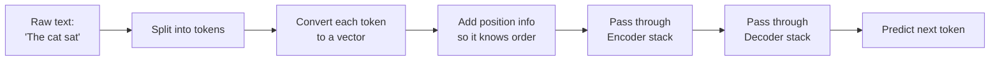
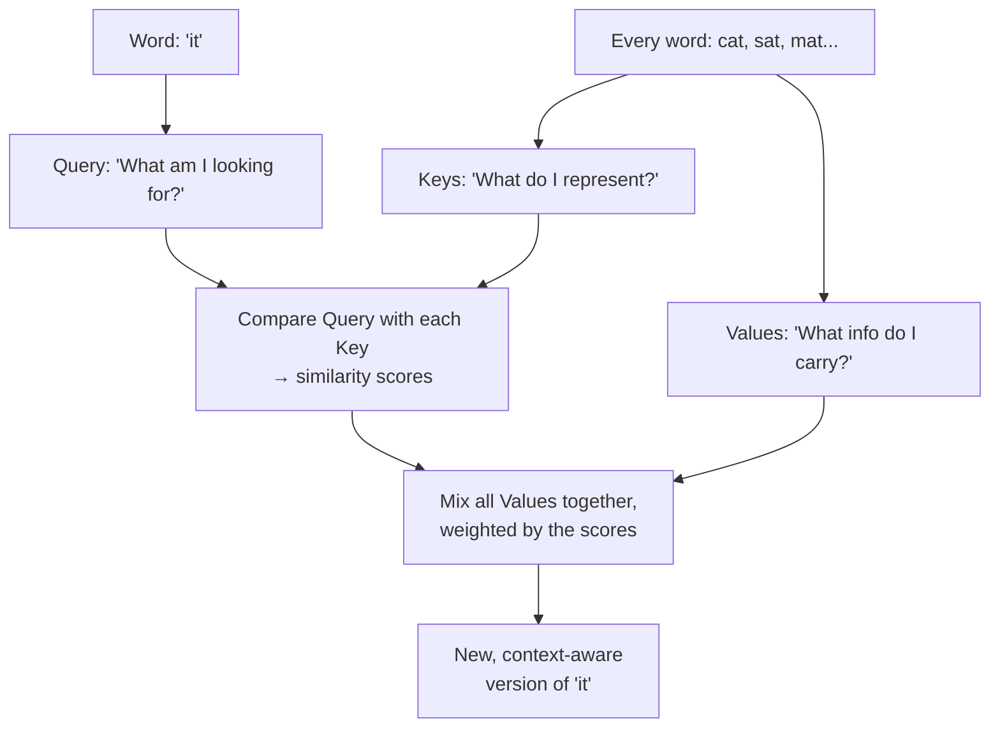
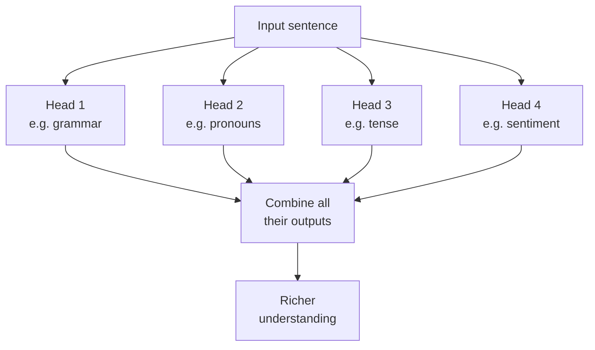
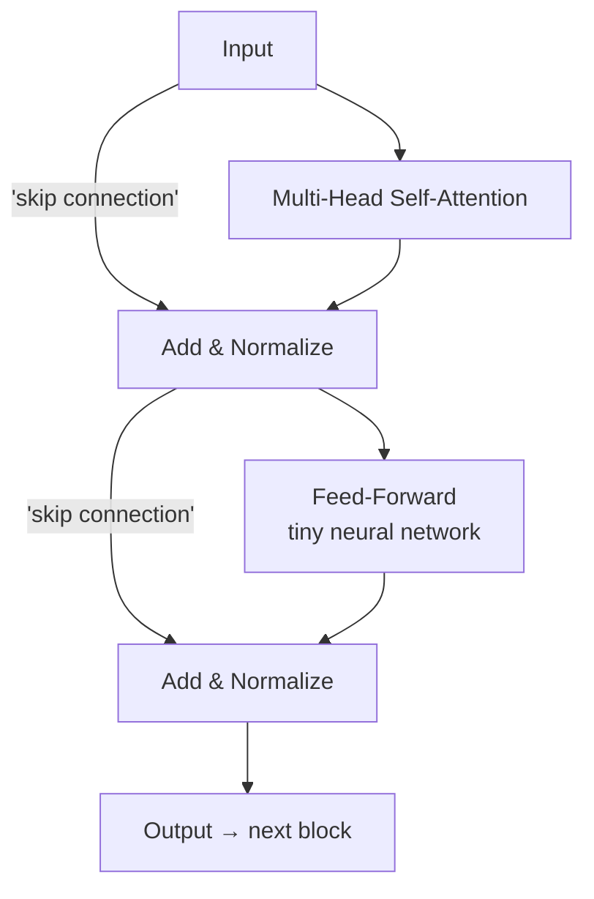
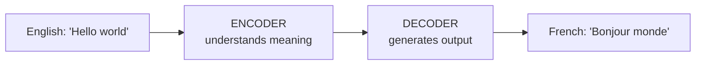
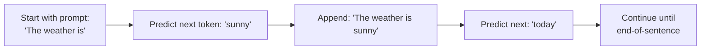

# Transformers — The Easy Version (No Math, Just Intuition)

> Read this once tonight. No formulas, no matrix math. Just clear ideas and analogies. For interviews, this is enough.

---

## Part 1: WHY were Transformers invented?

Before 2017, if you wanted a computer to understand a sentence, you used something called an **RNN (Recurrent Neural Network)** or its better cousin **LSTM**. These read text **word by word, left to right**, like a person reading.

### The 3 big problems with reading word-by-word

**Problem 1: It's slow.**
Imagine you have 100 employees but you tell them "no one can start working until the person before you finishes." That's an RNN — it has to process word 1 before word 2 before word 3. You can't use modern GPUs (which love parallel work) properly.

**Problem 2: It forgets long-range stuff.**
Read this sentence: *"The cat, which grew up on a farm in the countryside surrounded by chickens and goats, was hungry."*

By the time the model reaches "was hungry," it has half-forgotten that we were talking about the cat. The information faded through all those middle words. This is called the **vanishing gradient problem** — old information loses signal as it travels through many steps.

**Problem 3: One single summary vector.**
In old translation systems, the entire English sentence was squeezed into one fixed-size vector, and then a decoder unpacked that vector into French. Imagine summarizing a 50-page document into one sentence and then asking someone to recreate the document from that sentence. Bad idea.

### The Transformer's bold idea (2017 paper "Attention Is All You Need")

Don't read word by word. **Look at all the words at once, and let each word decide which other words are important to it.**

That's the whole trick. Everything else is plumbing.

---

## Part 2: The 30-second pitch (memorize this)

> "A Transformer is a neural network that processes a sentence all at once instead of word-by-word. Each word uses something called **self-attention** to look at every other word and decide which ones are relevant to its meaning. This makes it fast (parallel) and good at long-range understanding. It's the architecture behind BERT, GPT, ChatGPT, Claude — basically every modern AI."

---

## Part 3: The full journey of a sentence (zoom out first)

Here's what happens when you give a Transformer a sentence:

The rest of this file just explains each of those boxes.

---

## Part 4: Tokenization (turning words into numbers)

Computers don't understand words, they understand numbers. So step one is **tokenization** — chopping the sentence into pieces and giving each piece a number.

Modern tokenizers don't split by whole words (too many possible words). They split into **subwords**.

Example:
- The word `"playing"` becomes `["play", "##ing"]`
- The word `"unhappiness"` becomes `["un", "happi", "ness"]`

This way, even words the model has never seen can be broken into known pieces. Each piece gets a unique ID (a number).

**Three common tokenizers:**
- **BPE (Byte-Pair Encoding)** — used by GPT
- **WordPiece** — used by BERT
- **SentencePiece** — used by T5, LLaMA

For an interview, just say: *"Modern Transformers use subword tokenization, which breaks words into smaller pieces so unknown words can still be handled."*

---

## Part 5: Embeddings (numbers → meaningful vectors)

Each token ID is then turned into a **vector** — a list of numbers (like 512 or 768 numbers long). This vector represents the meaning of the word.

**Analogy:** Imagine every word has a "personality profile" — a list of scores like:
- How positive/negative is it?
- Is it about food?
- Is it about emotions?
- Is it formal/casual?
- ...and 500 more such hidden dimensions.

Similar words have similar vectors. The vectors for "king" and "queen" are close to each other. Far from "table."

These vectors are **learned** during training — the model figures out the best vector for each word by reading billions of sentences.

---

## Part 6: Positional Encoding (telling the model about word order)

Here's a weird problem. Self-attention treats words like a **set**, not a sequence. To it, "dog bites man" and "man bites dog" look identical because it sees them all at once.

That's a disaster — order matters in language!

**Solution:** We add a special "position signal" to each word's vector. Word at position 1 gets a position-1 signal added. Word at position 2 gets a position-2 signal. And so on.

**Analogy:** Imagine 5 students standing in a row. Each is wearing a name tag (the embedding). Now we also give each one a number badge: "1st," "2nd," "3rd"... The badge is the positional encoding. Now we know not just who they are but also where they're standing.

The original paper used **sine and cosine waves** to generate these position signals (don't worry about the math — just know they're a pattern that uniquely identifies each position). Modern models use other methods like **RoPE** (Rotary Position Embedding).

**For interview:** *"Self-attention has no concept of order on its own, so we add positional encodings to each token's vector to tell the model where each word sits in the sequence."*

---

## Part 7: SELF-ATTENTION — the heart of everything

This is the most important part. Read it carefully. No math, I promise.

### The core idea in one line
For every word in the sentence, ask: *"Which other words should I pay attention to in order to understand my own meaning?"*

### A real example

Sentence: *"The animal didn't cross the street because **it** was too tired."*

What does "it" refer to? You instinctively know "it" means "the animal." But how does the model figure that out?

Self-attention lets the word "it" **look around** at every other word in the sentence and decide:
- "The" → not very important
- "animal" → VERY important (let me focus here!)
- "didn't" → not important
- "cross" → a little important
- "street" → also possible (could "it" be the street?)
- ...

The model gives each word an **attention score**, and the word "it" essentially says: "I'm mostly about *animal*, with a little flavor of *cross* and *tired*."

That's it. That's self-attention.

### The Q, K, V analogy (the most common interview question)

Self-attention works using three things called **Query, Key, and Value** for each word. The best way to understand this is with a library analogy.

Imagine you walk into a library:

- **Query (Q)** = Your search request. ("I'm looking for books about cats")
- **Key (K)** = The label on each book's spine. ("This book is about animals," "this one is about cars")
- **Value (V)** = The actual content inside the book.

The process:
1. You compare your Query against every book's Key to see how well they match.
2. Books with matching keys get a high score; unrelated ones get low scores.
3. You then read a "mix" of the books, weighted by those scores — mostly the relevant books, barely any of the irrelevant ones.

**In self-attention:**
- Each word generates its own Query, Key, and Value (three different versions of itself).
- Every word's Query is compared against every other word's Key → produces attention scores.
- The final output for each word is a **mix of all the Values, weighted by those scores**.

So the word "it" looks at every word's Key, finds that "animal"'s Key matches best, and absorbs mostly "animal"'s Value into its new representation. Now the model effectively knows "it = animal."

### Visualize the flow

**Mnemonic:** *"Query asks, Keys advertise, Values deliver."*

### Why is it called "scaled dot-product attention"?
- **Dot-product:** The way we measure how similar a Query is to a Key (it's a standard math operation, but you don't need to know it).
- **Scaled:** We divide by a number to keep things stable during training (prevents extreme values).

You can skip this in interviews unless they specifically ask why we "scale."

---

## Part 8: Multi-Head Attention (looking at things from many angles)

Instead of doing attention **once**, Transformers do it **multiple times in parallel** — usually 8 or 12 times. Each one is called a "head."

**Why?** Different heads can learn to focus on different relationships.

**Analogy:** Imagine 8 people each read the same sentence:
- Person 1 focuses on *grammar* (what's the subject and verb?)
- Person 2 focuses on *who refers to whom* (pronouns and their antecedents)
- Person 3 focuses on *time/tense*
- Person 4 focuses on *sentiment*
- ...

Then they all share notes, and we combine their insights into one richer understanding.

That's multi-head attention. Each head learns a different "type of attention," and the final output combines them all.

**For interview:** *"Multi-head attention runs several attention operations in parallel, each learning to focus on a different type of relationship between words. Their outputs are then combined."*

---

## Part 9: What's inside one Transformer "block"?

A single Transformer block (a layer) is just a stack of a few simple things:

1. **Multi-Head Self-Attention** — what we just learned
2. **Add & Normalize** — keeps numbers stable, helps training
3. **Feed-Forward Network** — a simple neural network applied to each word (this is where a lot of "knowledge" actually gets stored)
4. **Add & Normalize** again

**Two concepts to know:**

- **Skip connection (residual)** = "remember the original input alongside the new output." This helps gradients flow during training and prevents the model from forgetting what it learned earlier.
- **Layer Normalization** = a stability trick. Keeps the numbers in a reasonable range so training doesn't blow up.

Don't worry about the math behind these. Just know **what they do** and **why they exist**.

---

## Part 10: Encoder vs Decoder (the big picture)

The original Transformer paper had **two halves**:

### Encoder (reads and understands)
Takes the input sentence and produces a rich representation. It's **bidirectional** — every word can look at every other word, including future ones.

Think of an encoder like a **reader** — it reads the whole input and forms a deep understanding.

### Decoder (writes word by word)
Takes that rich representation and generates output one word at a time. It's **causal** (one-directional) — when generating word 5, it can only look at words 1-4 (it can't peek at the future, because the future doesn't exist yet during generation).

Think of a decoder like a **writer** — it produces output one word at a time, using everything written so far.

### The 3 families of Transformers

| Type | Has | Famous example | Best for |
|---|---|---|---|
| **Encoder-only** | Just the reader | **BERT** | Understanding tasks (classification, sentiment, NER) |
| **Decoder-only** | Just the writer | **GPT** (ChatGPT, Claude) | Generation tasks (chatbots, text completion) |
| **Encoder-Decoder** | Both | **T5, BART** | Translation, summarization |

**For interview:** *"Encoder-only models like BERT are great for understanding text bidirectionally. Decoder-only models like GPT are great for generating text one word at a time. Encoder-decoder models like T5 are used for tasks like translation where you need to read one thing and produce another."*

---

## Part 11: Decoder's special trick — Masking

When a decoder is being trained or generating, it must **not** see future words. Otherwise, it would just memorize the answer instead of learning to predict it.

**Solution:** A **mask** is applied during attention that hides future positions. When generating word 5, the attention scores for words 6, 7, 8... are set to negative infinity (so they get zero attention).

**Analogy:** Imagine writing a test where you must complete each sentence one word at a time, and someone keeps covering the rest of the page with their hand so you can't peek.

This is called **causal masking** or **autoregressive generation**.

---

## Part 12: Cross-Attention (how encoder and decoder talk)

In an encoder-decoder model, the decoder needs to use information from the encoder. It does this with **cross-attention**.

**How it works:**
- The decoder's Queries come from the decoder itself (the words generated so far)
- But the Keys and Values come from the **encoder's output** (the original input understanding)

**Analogy:** A student (decoder) writing an essay, occasionally glancing at their notes (encoder output) to make sure the essay matches the source material.

For interview: *"Cross-attention is how the decoder pays attention to the encoder's output. The decoder generates queries from its own state but uses keys and values from the encoder, so it can ground its output in the input."*

---

## Part 13: How Transformers are trained

### BERT-style (Masked Language Modeling)
Take a sentence, randomly hide 15% of the words with a `[MASK]` token, and ask the model to guess them.

Example:
- Original: "The cat sat on the mat."
- Input: "The cat sat on the [MASK]."
- Task: Predict "mat"

Doing this billions of times forces the model to learn the meaning of words and how they relate. Result: a bidirectional understanding of language.

### GPT-style (Next-Token Prediction)
Take a sentence, show the model words 1 through n, and ask it to predict word n+1.

Example:
- Input: "The cat sat on the"
- Task: Predict "mat"

Then predict the next, and the next, building up a sentence word by word. This is also called **autoregressive language modeling**.

### Two phases everyone talks about

1. **Pretraining** — the huge, expensive phase. Train on billions of sentences from the internet. Costs millions of dollars. The model learns general language understanding.
2. **Fine-tuning** — cheap phase. Take the pretrained model and train a bit more on your specific task (e.g., classifying SMS messages, or answering medical questions).

---

## Part 14: Inference (how it generates text)

Generation is **autoregressive** — one word at a time:

**How does it pick the next word?**
At each step, the model produces probabilities for every possible next word. Different "decoding strategies":

- **Greedy** — always pick the most probable word. Fast but boring/repetitive.
- **Beam search** — keep track of the top-N most likely sequences. Better quality but slower.
- **Sampling with temperature** — randomly sample from the probability distribution. Higher temperature = more random/creative. Lower temperature = more conservative.
- **Top-k sampling** — only consider the top k most likely words.
- **Top-p (nucleus) sampling** — only consider the smallest set of words whose total probability is at least p (like 0.9).

**For interview:** *"At inference, the model predicts probabilities for the next token and we use strategies like greedy, beam search, or sampling with temperature to pick one."*

---

## Part 15: The famous limitation (O(n²) attention)

Here's the catch with Transformers: **self-attention is expensive**.

Every word looks at every other word. If you have 1,000 words, that's 1,000 × 1,000 = 1,000,000 comparisons. Double the input length, and the cost goes up 4x. This is what people mean when they say attention is **quadratic** (O(n²)).

That's why long context (like 100,000 tokens) is expensive — it's a real problem the field is still solving.

**Solutions people have built:**
- **FlashAttention** — same math, just much more memory-efficient
- **Sparse attention** (Longformer, BigBird) — let each word attend only to nearby words
- **Linear attention** (Performer) — clever approximations
- **RoPE / ALiBi** — better positional encodings that work for long sequences

---

## Part 16: BERT vs GPT (quick comparison)

People love asking this. Here's the clean answer.

| | BERT | GPT |
|---|---|---|
| Architecture | Encoder-only | Decoder-only |
| Direction | Bidirectional (sees full context) | Left-to-right (causal) |
| Pretraining | Masked Language Modeling | Next-token prediction |
| Strength | Understanding (classification, NER) | Generation (chat, completion) |
| Year | 2018 (Google) | 2018 onwards (OpenAI) |

**One-liner:** *"BERT understands, GPT generates. BERT is an encoder, GPT is a decoder. BERT was trained by guessing masked words; GPT was trained by guessing the next word."*

---

## Part 17: The most likely interview questions (with simple answers)

**Q: What is a Transformer in one sentence?**
A: A neural network that uses self-attention to process all words of a sentence in parallel, letting every word focus on whichever other words are most relevant to it.

**Q: Why are Transformers better than RNNs/LSTMs?**
A: They process all words in parallel (so they're fast on GPUs), and self-attention lets every word directly connect to every other word, no matter how far apart they are. RNNs had to read word-by-word and forgot distant context.

**Q: What is self-attention?**
A: A mechanism where every word looks at every other word in the sentence and figures out how much to focus on each one. The result is a richer, context-aware version of that word.

**Q: What are Q, K, V?**
A: For each word, the model creates three vectors: a Query (what it's looking for), a Key (what it advertises about itself), and a Value (the information it carries). Queries are compared against Keys to get attention scores, and Values are mixed using those scores.

**Q: What is multi-head attention?**
A: Running self-attention multiple times in parallel, with each "head" learning a different type of relationship. The outputs are combined into a richer representation.

**Q: How does the Transformer know the order of words?**
A: Through positional encodings — special signals added to each word's vector that indicate its position in the sentence.

**Q: What is the difference between an encoder and a decoder?**
A: An encoder reads the input and creates a rich understanding (bidirectional — every word sees every other). A decoder generates output one word at a time, and can only see words generated so far (causal masking).

**Q: What is masking in a decoder?**
A: A trick to prevent the decoder from peeking at future words during training and generation. It's called causal masking.

**Q: What is cross-attention?**
A: In encoder-decoder models, it's how the decoder uses the encoder's output. The decoder asks the queries; the keys and values come from the encoder.

**Q: What is BERT?**
A: An encoder-only Transformer pretrained with masked language modeling. It's great for understanding tasks because it learns bidirectional context.

**Q: What is GPT?**
A: A decoder-only Transformer pretrained on next-token prediction. It's great for generation because it learns to produce text one token at a time.

**Q: What is the main limitation of Transformers?**
A: Self-attention scales quadratically with sequence length — doubling the input length quadruples the computation. That's why long context is expensive.

**Q: What is a token / tokenization?**
A: Tokens are the small pieces of text the model actually processes (usually subwords, not full words). Tokenization is the process of splitting text into these pieces.

**Q: What is an embedding?**
A: A vector (list of numbers) that represents the meaning of a word. Similar words have similar embeddings.

**Q: Why do we use feed-forward networks inside a Transformer block?**
A: They add capacity and non-linearity to the model. They're where a lot of the actual "knowledge" gets stored. Each word goes through the same feed-forward network independently.

**Q: What are residual connections and why?**
A: They add the input of a layer to its output. This helps gradients flow during training and prevents very deep networks from degrading.

---

## Part 18: One-glance summary (read this last)

- **Transformer** = a model that processes whole sentences in parallel using self-attention.
- **Self-attention** = each word looks at every other word and decides what's important.
- **Q, K, V** = like a library search: queries match against keys to retrieve mixed-up values.
- **Multi-head attention** = doing self-attention several times in parallel, each focused on something different.
- **Positional encoding** = tells the model what order the words are in.
- **Encoder** = reads, **Decoder** = writes.
- **BERT** = encoder, understands. **GPT** = decoder, generates.
- **Masking** = stops the decoder from cheating by looking at future words.
- **Main weakness** = quadratic cost with sequence length.

---

## Final tip for your interview

If they ask *"explain Transformers"*, structure your answer like this:

1. **Why they exist** — RNNs were slow and forgot long-range info. Transformers fix both.
2. **The big idea** — self-attention lets each word look at every other word.
3. **Q, K, V** — explain with the library analogy.
4. **Multi-head** — multiple attentions in parallel, each focusing on something different.
5. **Encoder vs Decoder** — one reads, one writes. BERT and GPT examples.

You don't need a single formula. Just the story and the intuition.

Go crush it tomorrow. You've got this. 🚀
